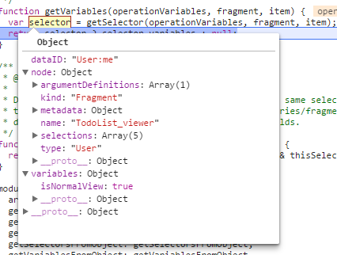

## a healthy flow output
terminal
flow on centOS works fine. on windows git-bash, the behavior is a bit unpredictable (keeps restarting ..etc)
```
$ flow status --no-auto-start  --json
{"flowVersion":"0.46.0","errors":[],"passed":true}
```
flow output
```
[2017-05-26T03:05:53.646Z] [INFO] flow - Path to Flow: flow
[2017-05-26T03:05:53.714Z] [INFO] flow - [unknown]: Flow server in d:\relay-modern
[2017-05-26T03:05:53.962Z] [INFO] flow - [ready]: Flow server in d:\relay-modern
[2017-05-26T03:05:55.451Z] [INFO] flow - [not running]: Flow server in d:\relay-modern
[2017-05-26T03:05:55.734Z] [INFO] flow - [init]: Flow server in d:\relay-modern
[2017-05-26T03:06:10.390Z] [INFO] flow - [ready]: Flow server in d:\relay-modern
```


1. each fragment *instance* (containers) has a `FragmentSpecResolver`  which is of type `RelayModernFragmentSpecResolver`  
`class RelayModernFragmentSpecResolver implements FragmentSpecResolver`  
2. `RelayModernFragmentSpecResolver` has a list of selector resolvers, which are of type `SelectorResolver`
3. a `SelectorResolver` has a property called  `_selector: Selector;`, which is essentially a combination of query node (AST) + Variables. as shown below



